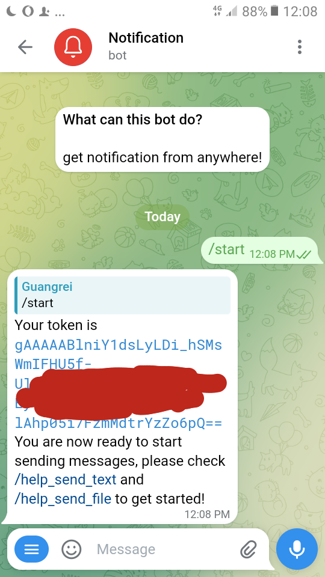
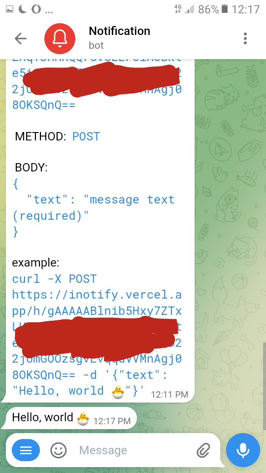
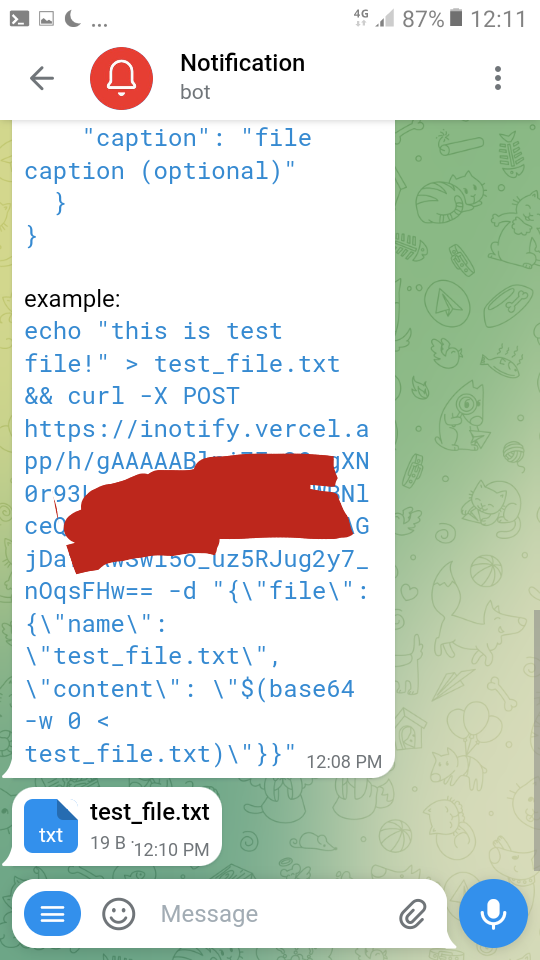

 

With [@sendh_bot](https://t.me/sendh_bot) you can easy send notification/message to telegram from anywhere (Terminal, CI/CD pipeline, IoT device etc)

This service is stateless, so your privacy is highly protected, and you can deploy it in your own instance.

## Run Locally

1. type command `poetry self add poetry-dotenv-plugin`.

2. type command `poetry update`.

3. edit `.env.example` and renamed to `.env`.

4. type command `poetry run python app.py`
 
5. open browser `https://your-host/update_webhook`

now you can start chatting with your bot :)
